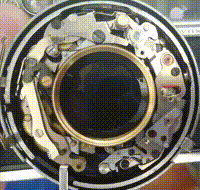

This website is primarily to serve some of the posts about bugs and
fixes.
It is arranged by
Dacarh
Mirell.
That's a human shade-tree tinkerer of biology, computer programs, and
bicycles, who likes to make use of a 25:24:1 back-extraction, a '90
stumpjumper comp with upside-down thumbies, arch + i3, and the 
UK LeGuin's "translation" of the Tao Te Ching.
They've contributed to some scientific papers (ORCID 
).
Preferred pronouns he/him, editor vi/vim. 

</a>

<!-- link CV here -->

You are an integral part of this website's function.  
Please share feedback or other thoughts by email [^email] 
or social media.
There's also Disqus forms if you'd like to leave a message. 

( It'd be interesting to see that anyone can use it, that'd be great. )

[^email]: This won't copy paste nicely, so just type it: dcokhg@rei guess they're just going to use OCR, right? or it's like a targetted thing, then it's a humanllimmaya don't sayil.com

