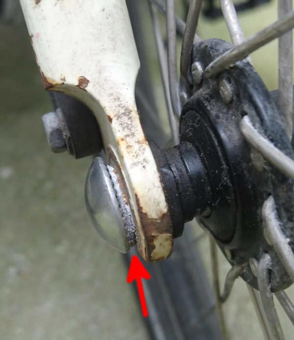
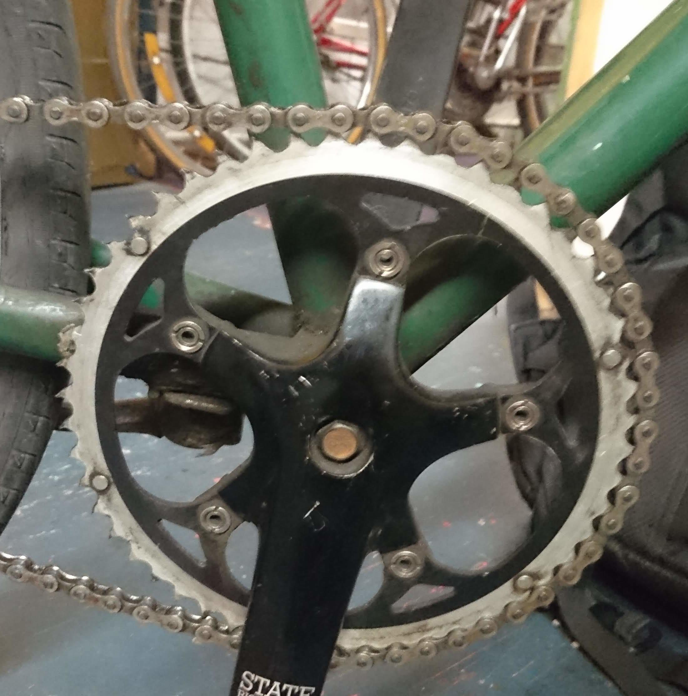
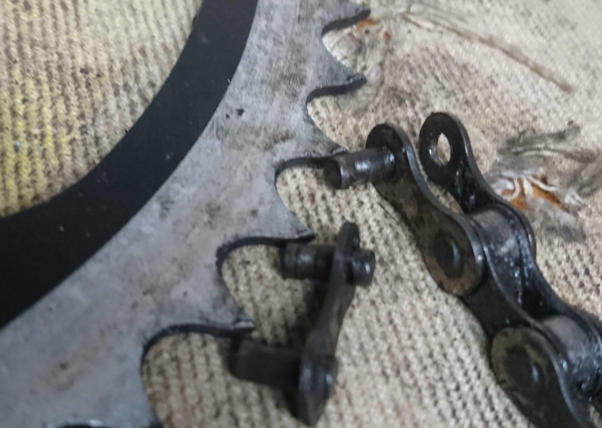
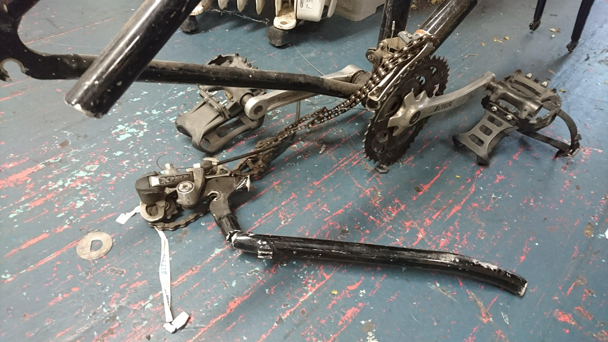

This is just to hold records of interesting things encountered in
bicycle usage and repair.

# The creaking sound of washer corrosion

After a NYC winter, I noticed a creaking sound coming from my front
wheel/fork setup. With some pushing and tweaking, I figured it 
sounded like it was coming from the wheel mounting, so I broke out
my pinhead adapter to remove the wheel.

This wheel was put on with a pinhead locking skewer probably 9 
months ago. I ride most days all weather in the NYC streets, bits of 
glass and what not, but it's got a Schwalbe Big Apple over a Mr 
Tuffy tire liner, so I hadn't had reason to take it off for a long 
long time.

To my surprise when I got down there, the washer that was between the
skewer head and frame was greatly reduced in size (red arrow).

Upon taking it off, I was able to crack the washer in half just by
pressing it against the ground. If it had fragmented in ride I might
have lost my front wheel, depending on the timing.

I don't know if that's a stock washer that came with the kit, or
something I put on, so I have no idea what it was made off or how to
prevent it. So, I just put on another steel washer. I figure I'll be
out of NYC before that one rots away.

Lesson is, exposed components sure can corrode in winters of slush
and salt.

# The most "stretched" out chain and sawtoothed gears I've ever seen 

This guy came into times up in brooklyn under the willyB.

The chain measured 11 links in 12 inches. That's a huge amount of
stretch. Look at these pins:

The gears are to the point of starting to wear away on height as well
and the tips are collapsing slightly.

Extreme wear. He swapped out the chainring and chain, and rode out
on the same rear freewheel. Seemed to work for now.

# Cannondale with the chainstay ripped off

We think this was the result of a collision of a car, given the bent chain ring
and extensive damage.

