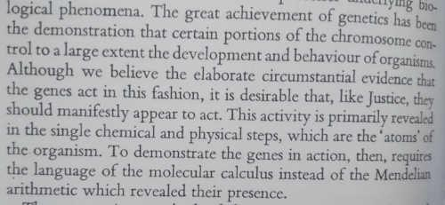
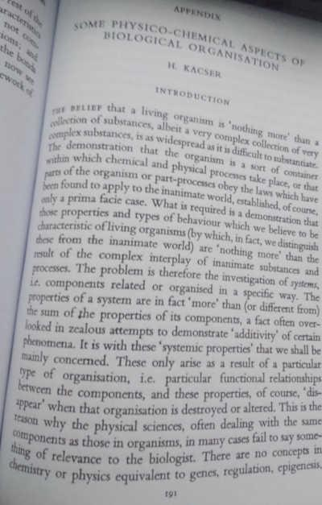
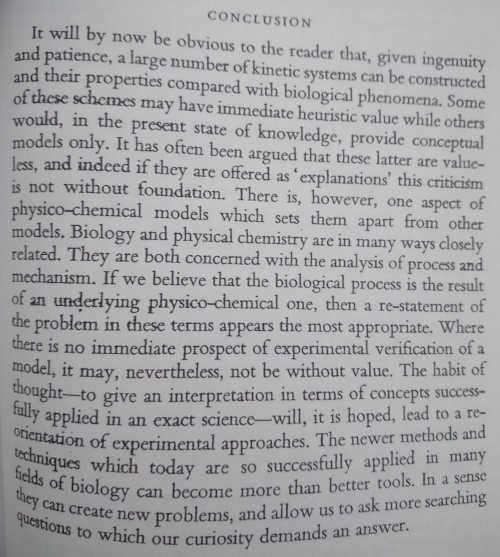
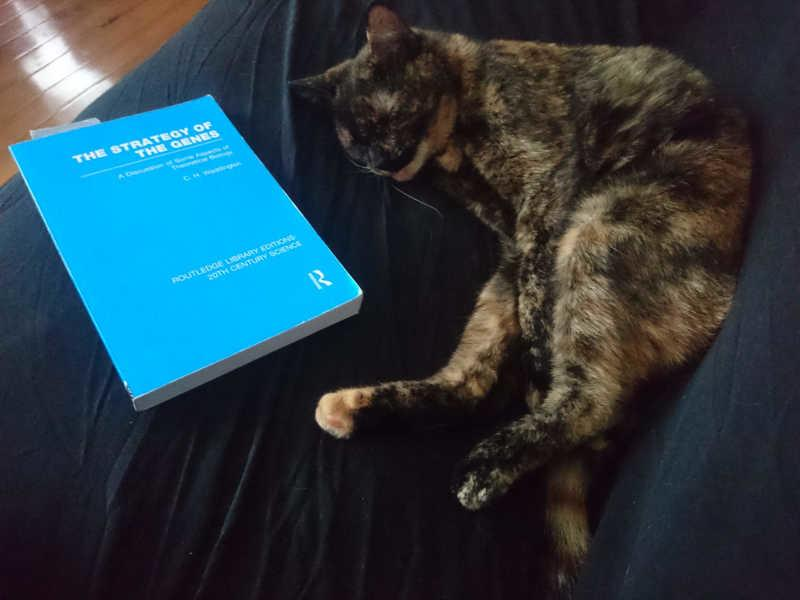

# [Can a biologist fix a radio?](http://dx.doi.org/10.1016/S1535-6108(02)00133-2)

Yuri Lazebnik's commentary uses the example of a 
simple radio to argue for a more theoretical 
and mechanistically fundamental understanding of
biological processes. An argument against genetics,
imho, but also a call to think about these 
limitations as we progress forward.
This is not to say that being
more technically sophisticated is the answer, 
like myriad examples in model system genetics or the recent
"omnigene" articulations of these, 
these make the point that biology is 
complicated. Especially in that last one, a lot of 
folks may feel like this is a case of "no shucks
sherlock", but I think it's important to accept 
and teach ideas as the paradigm so that we can 
immediately get everyone to question them further.

Pair with Kacser's "Some aspects..." 

# [Into the sciences](http://www.librarything.com/work/19756253/book/142780162)

Fredrick Ross is the guy who wrote in a widely circulated blog post: 
["Fuck you, bioinformatics. Eat shit and die."](http://madhadron.com/posts/2012-03-26-a-farewell-to-bioinformatics.html)

Dramatic title.
However, even while disagreeing with Ross I find his arguments very useful in 
thinking about the practice of science. It's even better when I agree!

For example, his perspective on how a non-biologist gets started in biology 
sounds like good advice and I've tried to use it.  I really like the phrase 
"science practitioner".  How you train is how you fight, and how you speak is
how you think, so little turns of phrase like this can be powerful.

# [Some physio-chemical aspects of biological organisation](https://books.google.com/books?id=69l1AwAAQBAJ) 

WARNING CAT PICTURE

This is the appendix to "The strategy of the genes", book of essays by 
Waddington. Kacser contributes the appendix, and for 1957 it's an especially 
prescient call for integrating biochemical modeling at the level of systems 
biology. The meat of it isn't very useful given our progress in abstracting 
these mechanisms but could be handy for someone new to developmental processes.

The best parts are the introduction and conclusion,
and I don't have a scanner so you'll have to be
satisfied with down-scaled cell phone photos or
just buy the book yourself.

About genetics:

Introduction calling for systems biology:

Really good conclusion:

Growing up in biology in the Age of the Sequencer,
it has felt like high-throughput biology has pushed
out some valuable reductionist work1.
and that the next step with these technologies is 
really to integrate the two so that we're not just 
doing high-throughput screens, we're doing 
high-throughput _measurements_ with assays that are 
readily interpretable back to biophysical properties.

And here's a picture of Tai with the book.
The parts that Waddington wrote are pretty good too,
classic figures. Development. Evolution. Etc.

1 To paraphrase the Buggles: ["sequencing killed the biochemistry star"](https://www.youtube.com/watch?v=Iwuy4hHO3YQ)

# [Advice to a young scientist](http://dx.doi.org/10.1118/1.594826)
    
Mendawar writes a fun one, especially if you're just starting out in the 
sciences. I really like the description of apparatus construction. The words
seem arcane in the age of kits and methods (for my field), but the metaphor is 
useful in thinking about how method development and science interact.

Some times you just gotta blow your own glass apparatus and roll your own code.
    
# ["The rediscovery of the unique"](http://fortnightlyreview.co.uk/2017/08/the-rediscovery-of-the-unique/)

H.G. Wells in 1891 discusses the paralysis of 
reductionism without synthesis. A quote:

> When we teach a child to count, we poison its 
> mind almost irrevocably. When a man speaks of a 
> thousand of bricks, he never dreams that he means
> a unique collection of uniques that his mind 
> cannot grasp individually. When he speaks of a 
> thousand years, the suspicion never crosses his 
> mind that he is referring to a unique series of
> unique gyrations on the part of the earth we 
> inhabit; and yet, if he is an educated man, he 
> knows perfectly well that the shape of the 
> earth’s orbit and the earth’s velocity are 
> things constantly changing! He is inoculated 
> with the arithmetical virus; he lets a watch 
> and a calendar blind him to the fact that every 
> moment of his life is a miracle and a mystery.

It's a usefully poetic way of thinking about the
eternal struggle of the needs for generalizing the
models learned in science, and reminds us that
there are two steps --- learning specifically and 
testing generally the hypotheses we use to build
more complex ideas. Or something like that.

And then there's the ending, which I cribbed for
the frontpiece of my phd thesis:

> Science is a match that man has just got alight. 
> He thought he was in a room — in moments of devotion,
> a temple — and that his light would be reflected 
> from and display walls inscribed with wonderful 
> secrets and pillars carved with philosophical systems
> wrought into harmony. 
>
> It is a curious sensation, now
> that the preliminary splutter is over and the flame 
> burns up clear, to see his hands lit and just a 
> glimpse of himself and the patch he stands on 
> visible, and around him, in place of all that human 
> comfort and beauty he anticipated, darkness still.

It nicely captured the feeling from 5.5 years of my 
life.

# ["The Logic of Chance"](https://www.amazon.com/gp/offer-listing/0133381064/)
                
Koonin. This was my introduction to the amazing work folks have
been doing with tons of microbial genomes to explore the tree
of life, or rather forests of trees of life. To compare it to
genetics, it's like "systems evolutionary biology", in that its
in making this comparisons at this higher level of how the whole
system of genomes has evolved, doing this gives them insight into
a new perspective on evolutionary biology. Fun read, and it might
be accessible for non-biologists as well, if my memory serves
me right.
[Here's a better review.](https://www.ncbi.nlm.nih.gov/pmc/articles/PMC3400892/)
