This is a turbidostat prototype with the aim of balancing cheapness, 
off-the-shelf-ed-ness, and minimal requisite expertise.

The culturing setup is copied from the 
["ministats" developed in Dunham's lab at UW](http://dunham.gs.washington.edu/protocols.shtml).
The coverslip-and-two-TSL235R's instrumentation is copied from the 
[turbidostat setup by folks in Klavin's lab also at UW](https://depts.washington.edu/soslab/turbidostat/pmwiki/).
The 12V transistor control circuit is from [bildr blog](http://bildr.org/2012/03/rfp30n06le-arduino/).
Extensive discussion, support, and some parts came from 
[Euguene Plaskin](https://twitter.com/mossomest) of the Siegal lab,
and from Nathan Brandt of Gresham lab, both at NYU.

# What's a turbidostat?

It's an instrument that keeps a liquid culture from being too turbid. It does
this by measuring turbidity (opaque-ness of liquid), and if it's too turbid 
then it dilutes it. Usually there's something growing in the liquid to make it
more turbid with time, so the balance of these two sort of makes the turbidity
constant.

It's different from a chemostat in that the turbidostat responds to the 
turbidity. Because of this, it doesn't rely on the microbes to balance their
own environment. It's more complicated than a chemostat.
It's sort of like an adaptive nutrient treadmill for microbes, one that makes
sure not to run you off the end of the treadmill.

So there's two main parts:

- culture turbidity sensing
- media addition control

# Here's how it's built

## The culturing fluidics

This is all built around a pyrex 9825, without the cap. 
This is the same tube as the Dunham ministats (I believe), so the same fluidics
should work for that.
This has a rubber stopper (stopping the ~25mm tube mouth), 
with three "needles" going through the stopper.
These are 5" blunt dispensing needles from amazon, but I would recommend 
finding some of smaller gauge, as 12 gauge were pretty big. Also, connecters
up top would make this a lot easier to assemble.

Here's an overview, then a gif detailing the needle setup.

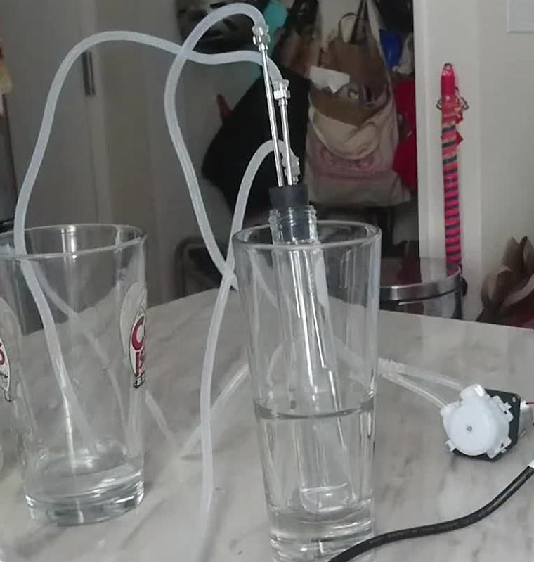

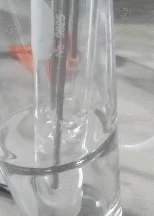

You can see the tube on the far right is the input adding water to drip into
the culture tube, the middle is a deeply inserted bubbler to aerate and mix the
culture, and the left needle is the output effluent needle. Because of the 
positive air pressure from the air pump (cheapest available for an aquarium,
seems stong enough to drive multiple cultures), the output effluent needle 
slurps up culture and dispenses it, to maintain a certain volume (wherever the 
needle is). For the actual run, I extended the bubbler needle by slipping a ~1 
inch sleeve of tubing over it to reach the bottom. It wasn't a tight fit, and 
didn't need to be, it was just a snorkle so most air went to the bottom.

For installing the needles, you can drill 1/8" holes and these 12 gauge needles
are very snug. Experiment to see how much you need to drill out.

Parts list:

- pyrex 9825 (not sure where to get this unless in large expensive packages,
  maybe check ebay, or design for a cheaper tube?)
- [5" dispensing needles](https://www.amazon.com/gp/product/B01M74MFUD/ref=oh_aui_detailpage_o00_s01?ie=UTF8&psc=1)
- [plastic tubing](https://www.amazon.com/gp/product/B01MXLBMUH/ref=oh_aui_detailpage_o00_s01?ie=UTF8&psc=1)
- [rubber stoppers](https://www.amazon.com/gp/product/B00EHXJ9IA/ref=oh_aui_detailpage_o00_s00?ie=UTF8&psc=1)
- [air pump](https://www.amazon.com/gp/product/B01N5341FR/ref=oh_aui_detailpage_o00_s01?ie=UTF8&psc=1)

## Input pump

Obviously, there was media going in. That's really important. I originally
was looking at solenoid pinch valves and a gravity feed setup, but then I was
shopping around and realized that peristaltic pumps are actually cheaper.
I found one for ~$10 with included tubing.

Here's what it looks like laid open:

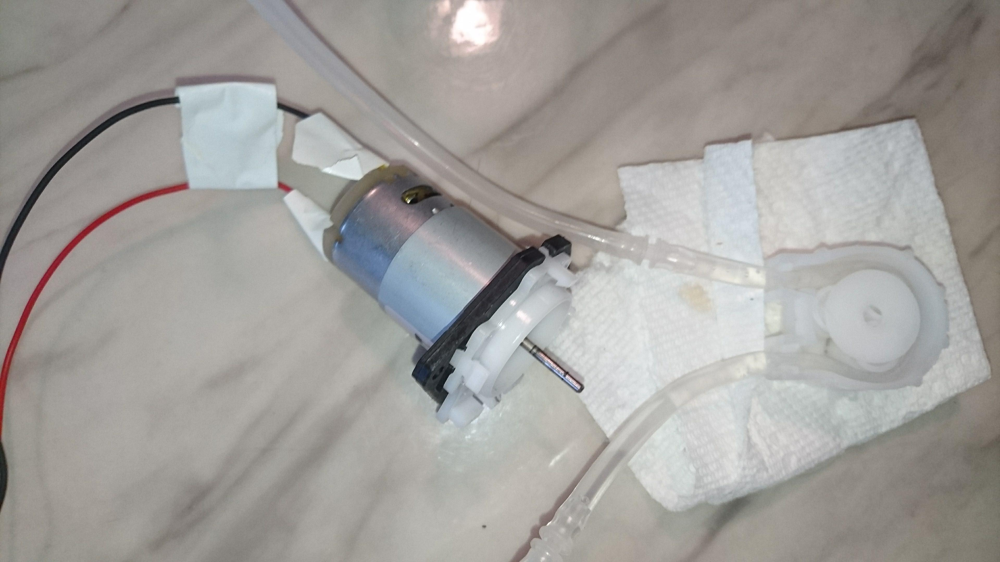

So this is pretty much a little shaft that spins the peristaltic three wheels
around, and then they just walk along the tube. Neat.
But, this is a 12V pump that requires some appreciable amperage. 
You can't be running this off of an output pin (I think). 
So that requires additional circuitry,
including a transistor. I used a MOSFET, althought I've heard some folks say
BJT are better for this kind of application. This seems to work great.

Here's a diagram, the idea is from [a bildr.org post](http://bildr.org/2012/03/rfp30n06le-arduino/):

          ____|____
          |-------|
          |-the---|
          |-pump--|
          |-------|
          |       |     MOSFET Transistor
          | +     |     Gate Drain Sink
          |-<<<<<-|     |    |     |
          | diode |     |    |     |
          |       |     -----|-----|-----+-------------Digital output pin
     +12V |       |          |     |     |             on the arduino (#5)
    -------       ------------     |     \ 10k
                                   |     / ohm
                                   |     \ resistor
     GND                           |     |             
    -------------------------------+-----+--------------GND pin on the arduino

The idea is that the current through the pump is interrupted by the transistor.
When you push some voltage between Gate (+) and Sink (ground), then it opens
up the current flow through Drain to Sink. When Gate isn't energized from the
pin, this is "pulled-down" to GND by a 10k resistor, to keep it securely off.
When the pump is active, it's got some good current going through it, and
the transistor. When that turns off, you can get a reverse voltage spike that
people say will fry the transistor, so that's why there's a flyback diode.
I'm not sure how to draw the directionality, but the positive end goes towards
the positive wire. If you get it wrong, the pump shouldn't run, so flip it.

The whole thing is powered by a 110V AC -> 12V DC adapter. This comes to me
courtesy of working on the same floor as the E-waste disposal. People throw
away all sorts of things, including fully functional AC adapters. I cut off the
connector and it's just bare wires. Going into the bread board.

So then you can control the media by controlling the voltage to one little gate.
Cool. This is done, as alluded to before, with an arduino, specifically an
arduino nano knock off from Tinkersphere in Manhattan.

This is one fundamental component I would change. The arduino is fine for what
you pay for, but it _only has two IRQ input pins_. These are essential for
using the sensor system with the TSL235R sensors, as you need the interrupts
to capture the rapid signals. I would try to find a board with more IRQ pins so
that I could multiplex control, but this is sufficient for running one culture.
Anyone looking to develop this further, maybe try something like the
[Pi Zero W](https://www.raspberrypi.org/products/raspberry-pi-zero-w/),
I read online that all their GPIO pins are IRQ. Correct me if I'm wrong!
(email or comments below)

Parts:

- [peristaltic pump](https://www.amazon.com/gp/product/B0791YL351/ref=oh_aui_detailpage_o00_s01?ie=UTF8&psc=1)
- [transistor](https://www.sparkfun.com/products/10213)
- [diode](https://www.sparkfun.com/products/8589)
- [resistor pack](https://www.sparkfun.com/products/10969)
- wires - I bought a pack of them from Tinkersphere in Manhattan
- arduino nano clone ~$14 in Tinkersphere 

## Sensing turbidity

The basic idea is that you shine light through the culture, and see how much
comes through. A really neat trick that the Klavin's lab people did is that
they use a coverslip to reflect the light to another sensor, and in doing so
you can account for light source variation. This becomes especially important
when we're using this LED of questionable consistency.

But how do you arrange this? I turned to foam posterboard 
(at [snewyuen](https://twitter.com/snewyuen)'s suggestion).
It's easy to cut, great for mounting components, and yes you can super glue it
(just make sure to focus on the paper, as the glue dissolves the foam).

Here's what the layout looks like:

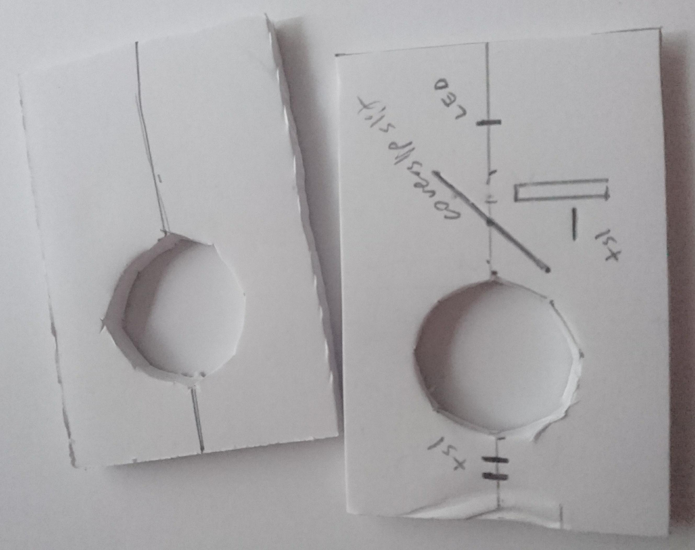

The hole is a (roughly) 1 inch diameter octagon. You can sketch this out easily
with a ruler, and with the give of the foam board it fits nice and snug to hold
the pyrex 9825 very well. The coverslip is positioned to 45 degrees to reflect
the LED image to that side sensor. The rectangle next to it is to block the 
direct LED light (with more posterboard).

Here's the next step in assembly:

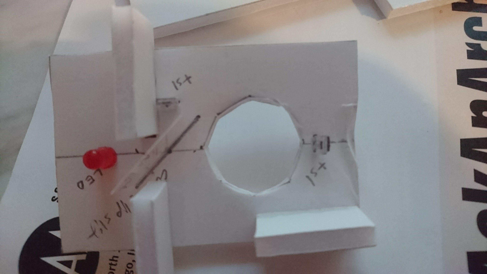

The components can be put in by putting a pushpin
through the board for the pins to go through. 

Each of the "tsl"'s are TSL235 light to frequency converters.
I tried a 257 light-to-voltage converter, but I found that to be very noisy
and had a much lower dynamic range. It was saturated by all but the faintest
of LEDs, and so I bought some 235's. These work great, great range, seems to
be very tight consistent signal. The only wrinkle is that you need to use
interrupts to read the signal (discussed in the code below).

The LED is one I got out of a bag of ~20 or so from Tinkersphere.
It could probably be brighter.

The coverslip goes through a 
1 inch cut in the board, so it's held by the board. The three rectangles are
cut out of the edge of the posterboard, and they're important for spacing.

These are glued on with super glue. Again, this melts the foam, but the paper
part is fine. So just set them on there and glue on the outsides.
If you do that, you can then flip a second 1" cutout board under it to make a
second holder, and that you can also glue feet onto for stability.

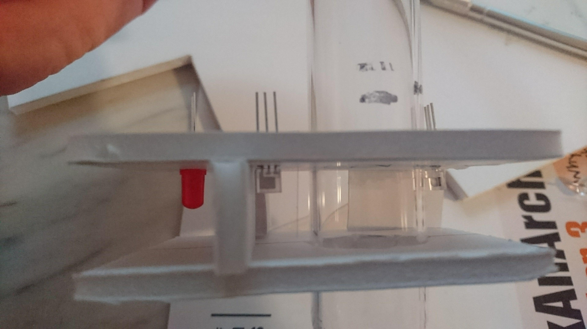

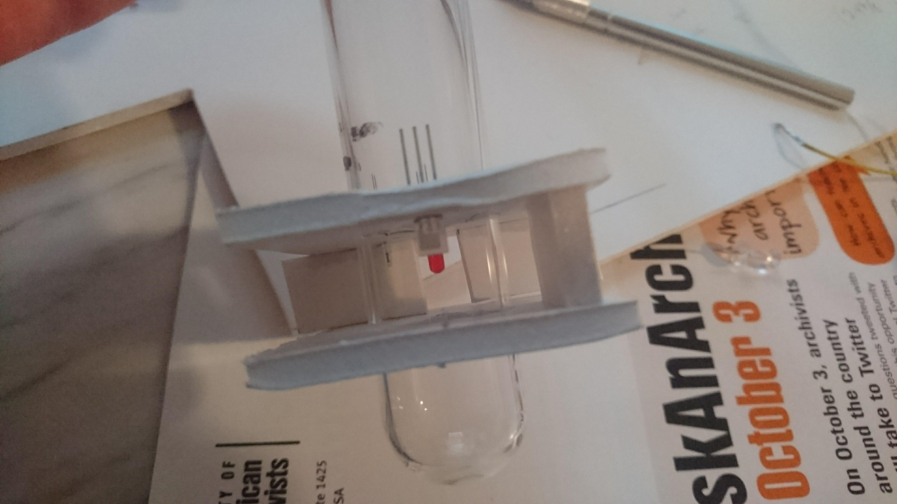

Then, you wire that up. I put the power and ground lines in parallel for the 5V
TSL235R's, and separate lines for the 3.3V LED. These I snaked through the lid
of the enclosure (will talk about that in just a sec).

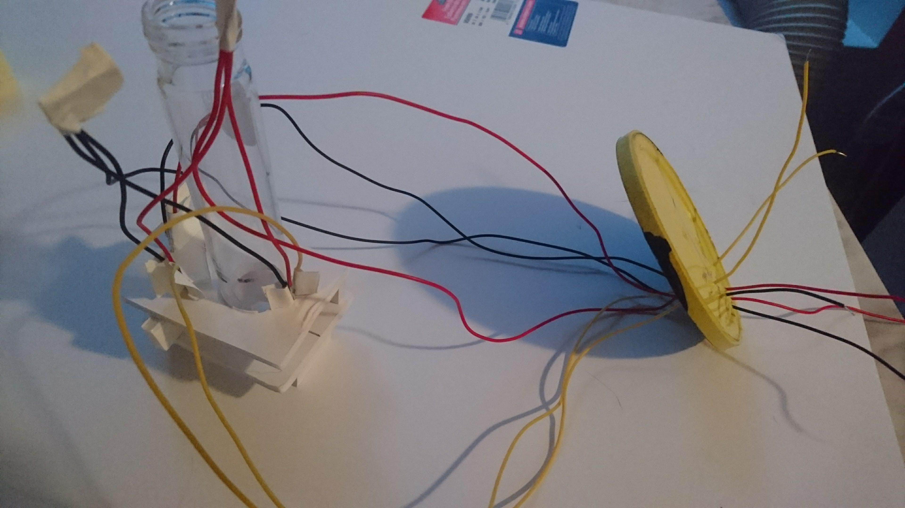

So this is all enclosed in a coffee can. Why? To block environmental light and
help cut down noise and bias on the sensors. It's not perfect, as the tube is
a bit high and has to go through a hole cut in the lid (bad planning). But, this
serves as a nice stabilizer. The inside of the coffee can is painted black,
but if I was doing it again I'd use black construction paper (less shiny) to
absorb all reflections of the LED inside the can.

So we then assembly it all and stick it in the can, then wire it up on the 
breadboard to the arduino.

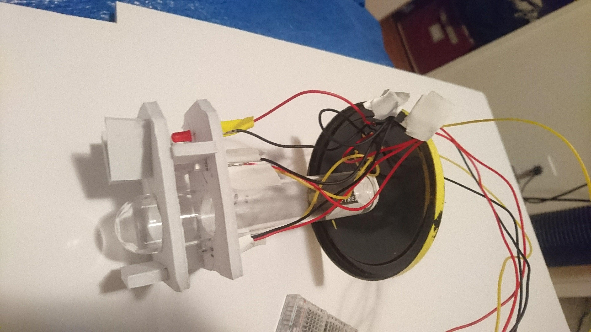
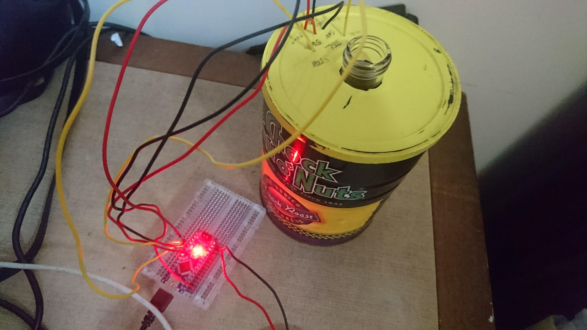

This can now measure the light at either sensor, and we can use that to compare
how much is going through that center line, through that glass tube.

Parts:

- [TSL235R](https://www.mouser.com/productdetail/ams/tsl235r-lf?qs=14HO7rLZPQsjmBHaoYCzkA%3D%3D), two of
- LED - not sure, it seems to be a pretty standard 3.3V red LED, but I'd prefer
  a brighter one
- poster board from Michael's art supply store
- super glue and exacto knife
- coverslip was donated
- coffee can
- wires

## Hooking it all up into one system, and programming it

So then you take the two systems (the transistor pump control, and the
light sensors), and you wire them up together. I have a 12V supply for the pump,
so I also had that go into the arduino nano clone in parallel (to the VIN pin).
This seemed to be important for reliable board function.
But, you still need the USB cable for serial data recording.

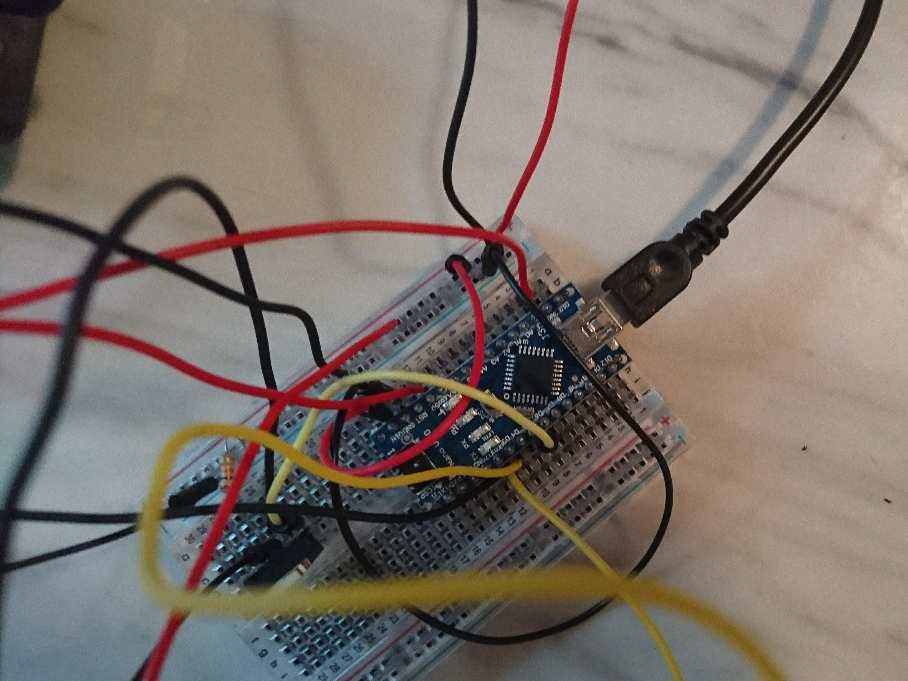

Now with the whole setup (in this picture the peristaltic pump is disassembled,
imagine it's reassembled):

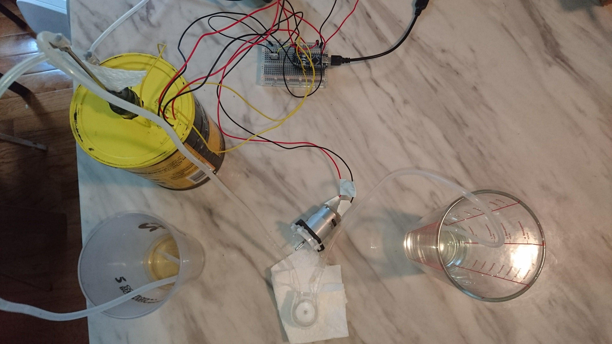

You can then program the arduino controller it with something like the below, 
which is cobbled together from many forgotten online sources.
Essentially, it defines two interrupts, and those sit on pins 2 and 3 and
whenever they get a signal they just increment a counter.
So then for 10 times, these are cleared, the controller waits a half second,
then stores the count.
These are averaged across the 10 samples, then reported, and it decides if it
wants to send some media into the culture tube.

    int pin_thru = 2 ;
    int pin_side = 3 ;
    volatile long count_thru = 0;
    volatile long count_side = 0;
    
    int sampling_time_ms = 500;
    int dilution_time_ms = 100;
    bool turbido_mode = true;
    float turbido_set = 0.8;
    
    int const window_size = 10;
    int thru_count[window_size];
    int side_count[window_size];
    float running_average_thru;
    float running_average_side;
    float running_average_ratio;
    
    String report_string = String();
    String instring = "";
    int mode = 0;
    
    void thrucount()
    {
      count_thru++;
    }
    
    void sidecount()
    {
      count_side++;
    }
    
    void setup() {
      Serial.begin(9600);
      attachInterrupt (digitalPinToInterrupt(pin_thru), thrucount, RISING);
      attachInterrupt (digitalPinToInterrupt(pin_side), sidecount, RISING);
      pinMode(5, OUTPUT); 
    }
    
    // the loop function runs over and over again forever
    void loop() {
      
      count_thru = 0;
      count_side = 0;
      for (int i=0;i<window_size;i++) {
        thru_count[i] = count_thru;
        count_thru = 0;
        side_count[i] = count_side;
        count_side = 0;
        delay(sampling_time_ms);
      }
      
      running_average_thru = 0;
      running_average_side = 0;
      running_average_ratio = 0;
      for (int i=0;i<window_size;i++) {
        running_average_thru += thru_count[i];
        running_average_side += side_count[i];
      }
      running_average_thru = running_average_thru / window_size;
      running_average_side = running_average_side / window_size;
      running_average_ratio = running_average_thru / running_average_side;
      
      report_string += String(running_average_thru);
      report_string += String(",");
      report_string += String(running_average_side);
      report_string += String(",");
      report_string += String(running_average_ratio);
      Serial.println(report_string);
      report_string = "";
    
      if (turbido_mode == true) {
        if (running_average_ratio < turbido_set) {
          digitalWrite(5, HIGH);
          delay(dilution_time_ms);
          digitalWrite(5, LOW);
        }
      }
    
    }
    
When this is running, it's recorded by listening with an Rscript that just
watches the serial port and reads in whenever it finds something. It also
updates a plot to just track it.

    library(serial)
    library(magrittr)
    library(ggplot2)
    library(tidyr)
    library(dplyr)
    
    con <- serialConnection(name = "test_con", #cribbed from somewhere online
                            port = "ttyUSB0",
                            mode = "9600,n,8,1",
                            buffering = "none",
                            newline = 1,
                            translation = "cr")

    open(con)

    datar <- data.frame(Time=Sys.time(),Thru=0,Side=0,Ratio=0)
    datar <- datar[-1,]

    while (T) {
        stopTime <- Sys.time() + 2
        while(Sys.time() < stopTime) {
            newText <- read.serialConnection(con)
            if(0 < nchar(newText)) {
                strsplit(newText,split="\n")[[1]][2] %>% 
                    strsplit(split=",") %>% 
                    lapply(function(x){
                            datar[nrow(datar)+1,1] <<- Sys.time()
                            datar[nrow(datar),2:4] <<- as.numeric(x)
                            return(NULL)
                        }) 
            }
        }
        print(
            datar %>% #gather(Variable,Value,Thru,Side) %>% 
                ggplot(.) + aes(x=Time,y=Thru/Side) + 
                geom_point()
            )
    }

    close(con)

That stores it in a dataframe, and then we can plot it.

Here's a stepped dilution of a tube of soy sauce to 0.3, 0.6, and 0.8 ratio of
through tube over the coverslip side signal.

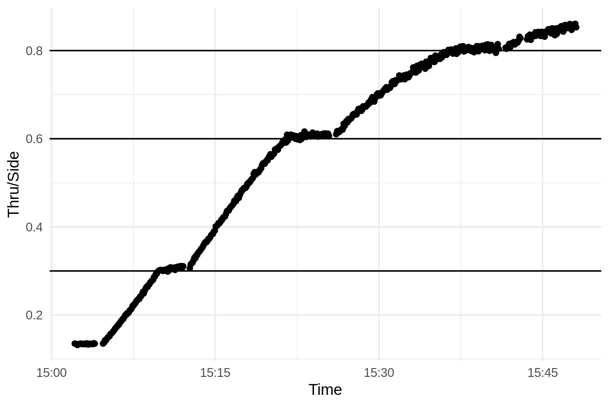

And here's a demonstration that we can dose in soy sauce and it'll recover
back up to the higher transmission (lower density):

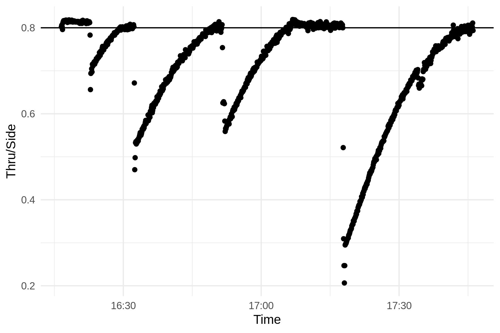

So that's the whole setup. Here's a little clip with my assistants in the 
background.

<video src="running_sub.mp4" controls></video>

# Conclusion

So that's it. It's a prototype, a project to explore the idea. I think it 
largely avoids difficult methods, especially in construction, and can be done
in a (my) kitchen in not too much time. 
It's not very robust, but it might be nice for a school project if someone wants
to nail down a few design elements that would make it easier. 
Here's some ideas:

- proper fluidics connectors
- better needle choice, 6" needles would probably stay out of the way better
- a microcontroller that can read more IRQ pins to handle multiple turbidostats
- an easy to find container for light isolation, or a shorter culture tube
- some mount for the components to make it tidier
- some way of sending controls back through the serial port, it should be doable

I've heard that raspberry pi's have more IRQ pins? I wonder if raspberry pi 1's
are cheap now on ebay?

Anyways, credits are at the beginning.
lemme know thoughts or comments on twitter, email, or the comments below.
