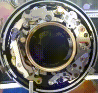
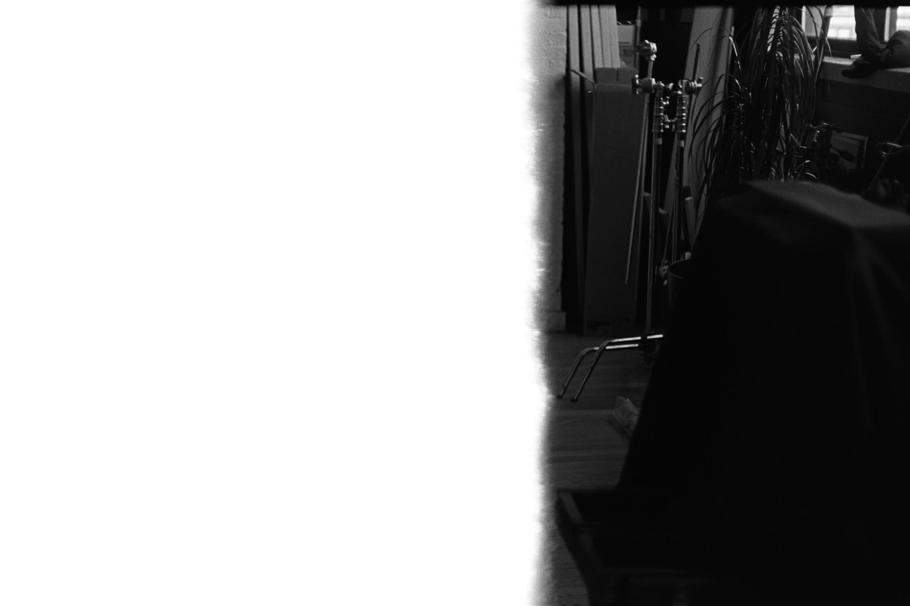

Someone left this camera behind in a house I used to live at, where
the garage accumulated odd media and machines of all kinds.
I picked it up because they were cleaning the garage and the camera
was broken, but it had a very obvious problem.

Problem not pictured: 
You'd cock it, press the shutter button, and the visible shutter 
leaves just kind of wiggle in a stuck configuration.
Given such an obvious defect, I figured that it was likely to be
the only thing wrong with it.
I found online a website[^first_website] that described the fix as 
simply putting a drop of rubbing alcohol on the shutters.

[^first_website]: that I can't for the life of me find now

The problem was the lockring. The outer-most (pictured above) would
come off easy with a screwdriver in one of the slots, but below
that is another ring that actually holds the lens in place.
At this point, I'm going to have to direct you to Mike Eckman's
excellent blog post[^eckman] for a better picture, and a far more
comprehensive guide, but it's that second ring to come off down
by step 1.
So, the camera got a sock around the lens and sat in the bottom of 
my electronics and gadgets box for ~8 years. 

[^eckman]: [Mike Eckman's guide to repairing a lynx 14 via canabalisim (from the camera's perspective)](http://www.mikeeckman.com/2016/11/yashica-lynx-14-1965/)

I was recently packing
to move, and decided to give it another go.
First up, I went ahead and bought a pin spanner. 
[This one](https://www.ebay.com/itm/Neewer-Adjustment-Jaw-Camera-Lens-Filter-Spanner-Wrench-Repair-Opening-Tool/191640713191)
was one of the first that came up. It's cheap and works great.
The pin spanner easily removed that lockring that had been stuck.
From there, I could directly clean the shutter blades/leaves. 

I first used 70% rubbing alcohol, and they immediately started 
working. I used a qutip and wiped the blades. I wasn't too careful,
but I'd recommend making sure you go with the direction of the blades
and just be real careful not to bend them.

*However this didn't work*, 
as they then they dried and stopped working, seemed to have a
bit of residue left on. So I tried again with ~90% rubbing alcohol.
Same deal. Then tried again with lighter fluid, having heard that
oughta do it. After drying, it didn't. At this point, I further
disassembled the camera for fun, while it was drying,
using Eckman's instructions[^eckman] to take it further apart.

Click on the image for a larger version. That's a long exposure
after the timer triggers the shutter open.

*What ended up fixing it* was using lots and lots of 
[electrical contact cleaner](https://www.homedepot.com/p/CRC-11-oz-QD-Electronic-Cleaner-05103/205021975).
This is a spray aresol. I have no idea if it'll take lens coatings
off, but I heard this camera doesn't have a coating. Well, it
sure doesn't now.
This cleaner, plus lots of my roommate's qutips, removed a bunch of 
junk and *importantly* dried without re-sticking the shutter.

With that, I loaded up some film from the Gowanus Darkroom,
burned through that and then broke the film, then reloaded and
finally learned how to use a film camera correctly.
Here's the first photo, half-advanced:

This camera's apparently known for having a ginormous lens, the 1.4
thing. Apparently that lets in a lot of light, but means you get
a real shallow depth of field / focus. Here's an example from that
first test roll, focused on that second bannister connection:

Subsequently, I got a case and lens cap (ebay), but learned that the
light meter ain't working. One day, maybe I'll fix that.
Until then, there's light meter apps for smartphones, so I'm using
that and learning a bit about the fun fiddling about that is film
photography.

The rangefinder on this camera sucks, although maybe because I'm just
used to someone else's SLR Pentax 1000. It's really hard to see the
yellow ghost image and get them lined up, especially on moving 
objects.

However, it's got a 1.4 lens, so I'm going to try and take advantage
of that with slower film, weird focus shots on still things.

Here's some photos

